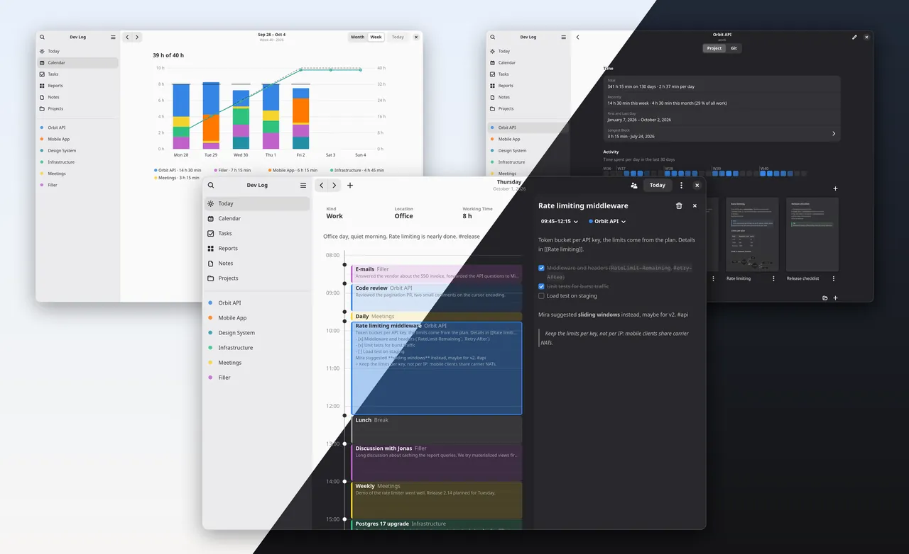

<div align="center">
  
  <h1>BitLog</h1>
  <p>A daily dev log for developers.</p>
</div>



BitLog splits the working day into blocks and assigns them to projects, roughly and without a stopwatch. Blocks can carry Markdown notes, projects keep a small set of notes and files of their own.

One task list stays in view on every day, so open tasks never need to be carried over. Reports show where your time went per week, month or year, and a standup summary is ready to be pasted into the chat. All data lives in plain text files in an ordinary directory, which you can sync with Git or anything else.

## Installing

Every [release](https://github.com/coffeebowl/bitlog/releases) comes with a Flatpak bundle, `bitlog-<version>.flatpak`. Download it and install it, either with your system's software app or on the command line:

```sh
flatpak remote-add --user --if-not-exists flathub https://dl.flathub.org/repo/flathub.flatpakrepo
flatpak install --user ./bitlog-<version>.flatpak
flatpak run dev.bitlog.BitLog
```

Flatpak fetches the GNOME runtime from Flathub. The bundle currently does not update itself: to update, install the bundle of a new release with `flatpak install --user --reinstall`.

## Documentation

- [Command line](docs/command-line.md): the command line tool `bitlog`.
- [Building](docs/building.md): building the app, the command line tool and the Flatpak.
- [File format](docs/format-spec.md): how a vault is stored in plain text files.

## What is a dev log?

If you're not familiar with the concept, read on.

A dev log is your diary as a software developer or engineer. You track what you did during the day and take notes on things that happened. At first, it's practical for the next daily or weekly. But after a while, and combined with search, it starts to give you more in return. You can look up things from months ago. You can even give an AI access to it and ask to summarize a few things for you. You can simply track your time when you're too lazy to do it every day in your company's apps. It also gives you a better feeling for how long things take, where you keep running into the same problems, and where you have already found solutions.

Maybe it's some kind of second brain, but one that's tied to time instead of a web of linked notes. You don't remember which note it was, but you remember it was around the time you worked on that export. And that's enough to find it.

So you just write down what matters right now. No getting stuck on questions like "where does this note belong?", "have I already written something about this?" and so on.

## About this project

<details>
<summary><b>Why this app</b></summary>

I know there are lots of note-taking and logging apps out there. For the last few years I used apps like Obsidian for my daily dev log. Most of them did either too little or too much. Over time a specific workflow emerged, and typing all that text by hand got annoying. Even templates, shortcuts and snippets weren't enough. I was close to using AI just to keep the formatting in shape and to point out what was missing or malformed.

A few months after I started taking notes, I barely used the "second brain" stuff anymore. What was left was just a daily dev log: simple Markdown notes for projects, and a simple overview of the day to note when I did what. I'm also not pedantic about every exact minute, so I started splitting my day into 15-minute chunks. That's where the idea for a separate app was born.

Also, the other apps never mention something like "Filler", as I like to call it: all the things around the day where you're not working on a specific project. Emails, longer chats, talking with your colleagues and so on. That's just reality. None of us works 9 hours a day straight on projects. So I needed to separate this time from the time I have to log for my company, but still keep it as part of my working time.

So yeah. It's "just another note-taking app", "just another time tracker", "just another task app" and "just another report tool"... but I wanted them combined in a useful way that suits my workflow. And maybe the workflow of others, too.
</details>

<details>
<summary><b>A thing about AI</b></summary>

I needed this tool to work offline. And if other developers were ever going to use it, that wasn't optional anyway: nobody wants their secret keys, personal info or brand-new project ideas to end up in a database somewhere on the internet. So it had to be a regular desktop app. And Markdown anyway, because "what if this app is gone", "AI likes it", "we can read it", "it's perfect for version control" and so on, blah blah.

The thing is: I'm a web developer. I build things for the browser, not for the desktop. But I use GNOME, so I wanted a real GNOME app with GTK and libadwaita, not another Electron app. And I have no experience with any of that, or with Rust. So yeah, I use AI to code this app. But still, I'm a developer, and I know when this crap gets a bit too wild and hacky just to fulfill my wishes. When that happens, I stop and look for a default or simpler solution. I also have a few colleagues review the app from time to time. They know Rust better than I do. So yes, this is AI code, but it's also open source. Have a look, so you can trust it. Trust me, trust the AI or trust my Rust colleague :D
</details>

## License

BitLog is licensed under the [GNU General Public License v3.0 or later](LICENSE).
